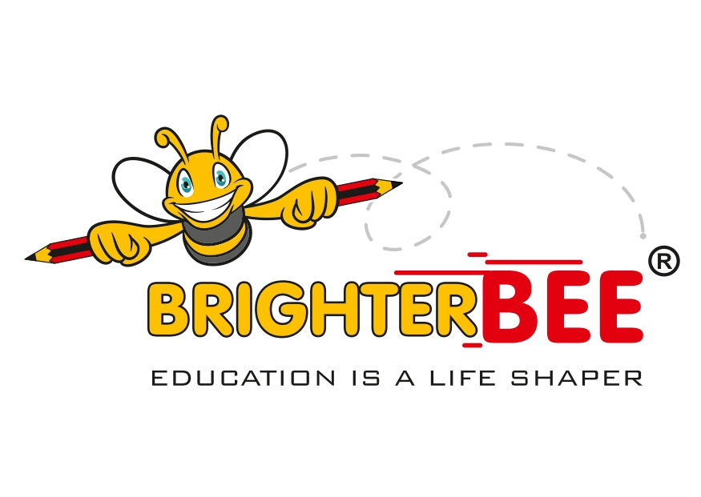

# 🐝 BrighterBee LMS

[](https://reactjs.org/)
[](https://www.typescriptlang.org/)
[](https://supabase.com/)
[](https://vitejs.dev/)



---

## 📖 Project Description

**BrighterBee LMS** is a preschool-focused Learning Management System built for **Brighter Bee**, located in **Surat, Gujarat, India**. The platform features a distinctive **bee-themed yellow and black UI** designed to create an engaging, child-friendly learning environment.

### Key Highlights

- 🎓 **Preschool Education Focus** – Designed for Nursery, Junior KG, and Senior KG students
- 🐝 **Bee-Themed UI** – Consistent honey-colored design system throughout
- 👥 **Role-Based Access** – Separate dashboards for Admin, Teacher, and Student
- 🎮 **Gamification** – XP, badges, streaks, and leaderboards to motivate young learners
- 📱 **Fully Responsive** – Works on desktop, tablet, and mobile devices

> **Note:** This is a personal portfolio/resume project. No real users, payments, or transactions are processed.

---

## ✨ Key Features

### 👨‍🎓 Student Features

| Feature | Description |
|---------|-------------|
| **Dashboard** | Personal overview of enrolled courses, progress, and gamification stats |
| **Browse & Enroll** | Explore available courses and self-enroll |
| **Lessons** | View lessons with resources and materials |
| **Quizzes** | Interactive quizzes with immediate feedback |
| **Assignments** | View and submit assignments with file upload |
| **Gamification** | Earn XP, level up, collect badges, maintain streaks |
| **Leaderboard** | Compete with other students for top ranks |
| **Certificate Preview** | View course completion certificates (preview only) |
| **Calendar** | View events, deadlines, and assignment due dates |
| **Kit Ordering** | Order study kits recommended by level and grade |
| **Profile Completion** | Required profile info before kit ordering |

### 👩‍🏫 Teacher Features

| Feature | Description |
|---------|-------------|
| **Dashboard** | Overview of courses, students, and recent activity |
| **Course Management** | Create, edit, publish, and delete courses |
| **Lesson Management** | Add lessons with descriptions and resource URLs |
| **Quiz Creation** | Create quizzes with MCQ and True/False questions |
| **Assignment Management** | Create assignments with due dates |
| **Submission Review** | View student submissions with name, time, and file |
| **Grade Assignments** | Provide grades and feedback on submissions |
| **View Results** | See quiz results and student performance |
| **Calendar** | Manage personal calendar and view course events |
| **Drag-and-Drop Upload** | Easy file and material uploads |

### 👨‍💼 Admin Features

| Feature | Description |
|---------|-------------|
| **Dashboard** | Platform-wide statistics and overview |
| **User Management** | View all users with emails, names, and roles |
| **Role Assignment** | Promote/demote users between roles |
| **User Deletion** | Permanently delete users (auth + all related data) |
| **Study Kit Management** | Create, edit, delete, and price study kits |
| **Kit Order Management** | View student kit orders and their status |
| **Transaction Dashboard** | Full income/expense tracking |
| **Analytics** | Platform usage and performance metrics |
| **Calendar** | Create system-wide events |
| **Course Oversight** | View all courses across all teachers |

---

## 🛠️ Tech Stack

### Frontend

| Technology | Purpose |
|------------|---------|
| **React 18** | UI library |
| **TypeScript** | Type-safe JavaScript |
| **Vite** | Fast build tool and dev server |
| **Tailwind CSS** | Utility-first CSS framework |
| **shadcn/ui** | Accessible UI component library |
| **React Router v6** | Client-side routing |
| **TanStack React Query** | Data fetching and caching |
| **React Hook Form + Zod** | Form handling and validation |
| **Lucide React** | Icon library |
| **Recharts** | Data visualization charts |

### Backend

| Technology | Purpose |
|------------|---------|
| **Supabase** | Backend-as-a-Service |
| **PostgreSQL** | Database |
| **Supabase Auth** | Authentication |
| **Supabase Storage** | File storage (assignments) |
| **Edge Functions** | Serverless functions (Deno) |
| **Row Level Security** | Database access control |

### Deployment & Hosting

| Platform | Purpose |
|----------|---------|
| **Vercel** | Production hosting |
| **GitHub** | Version control |
| **Supabase** | Backend infrastructure |

---

## 🗄️ Database Overview

### Core Tables

| Table | Description |
|-------|-------------|
| `profiles` | User profile information (name, avatar, phone, location) |
| `user_roles` | Role assignments (admin, teacher, student) |
| `courses` | Course details (title, description, grade level, teacher) |
| `lessons` | Lessons within courses with order and resources |
| `enrollments` | Student course enrollments |
| `lesson_progress` | Student lesson completion tracking |
| `assignments` | Course assignments with due dates |
| `assignment_submissions` | Student assignment submissions with grading |

### Quiz Tables

| Table | Description |
|-------|-------------|
| `quizzes` | Quiz metadata (title, passing score) |
| `quiz_questions` | Questions with options, answers, points |
| `quiz_attempts` | Student quiz submissions and results |

### Gamification Tables

| Table | Description |
|-------|-------------|
| `badges` | Available achievement badges |
| `user_badges` | Badges earned by users |
| `user_gamification` | XP and level tracking per user |
| `user_streaks` | Daily activity streak tracking |

### Kit & Commerce Tables

| Table | Description |
|-------|-------------|
| `study_kits` | Available study kits with pricing |
| `kit_orders` | Student kit purchase orders |
| `transactions` | Financial records (income/expenses) |

### System Tables

| Table | Description |
|-------|-------------|
| `events` | Calendar events (system-wide or course-specific) |
| `course_prerequisites` | Course prerequisite relationships |

---

## 🚀 Installation & Local Development

### Prerequisites

- **Node.js 18+** – [Download](https://nodejs.org/)
- **npm** or **bun** – Package manager
- **Git** – Version control

### Setup Steps

1. **Clone the repository**
   ```bash
   git clone https://github.com/your-username/brighterbee-lms.git
   cd brighterbee-lms
   ```

2. **Install dependencies**
   ```bash
   npm install
   # or
   bun install
   ```

3. **Create environment file**
   ```bash
   cp .env.example .env
   ```

4. **Configure environment variables** (see below)

5. **Start development server**
   ```bash
   npm run dev
   # or
   bun dev
   ```

6. **Open in browser**
   ```
   http://localhost:5173
   ```

---

## 🔐 Environment Variables

Create a `.env` file in the project root:

```env
# Supabase Configuration
VITE_SUPABASE_URL=https://your-project.supabase.co
VITE_SUPABASE_PUBLISHABLE_KEY=your-anon-key
VITE_SUPABASE_PROJECT_ID=your-project-id
```

| Variable | Description |
|----------|-------------|
| `VITE_SUPABASE_URL` | Your Supabase project URL |
| `VITE_SUPABASE_PUBLISHABLE_KEY` | Public anon key for client-side access |
| `VITE_SUPABASE_PROJECT_ID` | Supabase project identifier |

---

## 🔄 Database Migrations

### Running Migrations

Migrations are managed through the Supabase dashboard.

```bash
# Migrations are located in:
supabase/migrations/
```

### RLS Policies

All tables have Row Level Security (RLS) policies pre-configured:

- Users can only access their own data
- Teachers can access their courses and enrolled students
- Admins have full access to all data
- Quiz answers are verified server-side via secure RPC functions

---

## 🌐 Production Deployment

### Deploy to Vercel

1. **Connect GitHub repository**
   - Go to [Vercel Dashboard](https://vercel.com/dashboard)
   - Click "New Project"
   - Import your GitHub repository

2. **Configure environment variables**
   - Add all variables from your `.env` file
   - Vercel automatically handles the build

3. **Deploy**
   - Vercel auto-deploys on every push to `main`

4. **Custom domain (optional)**
   - Add your custom domain in Vercel settings

### Build Command

```bash
npm run build
```

Output is generated in the `dist/` folder.

---

## 📂 Git Workflow

### Repository Strategy

| Repository | Purpose |
|------------|---------|
| **Private Repo** | Development work |
| **Public Repo** | Production deployment (Vercel) |

### Sync Commands

Mirror changes from development to production:

```bash
# From your project directory
git fetch origin
git reset --hard origin/main
git push production main --force-with-lease
```

### Branch Strategy

- `main` – Production-ready code
- `develop` – Active development (if used)
- Feature branches for new features

---

## 📸 Screenshots

### Landing Page

*Bee-themed landing page with feature highlights*

### Student Dashboard

*Gamified student dashboard with XP and streaks*

### Teacher Dashboard

*Course and student management interface*

### Admin Panel

*Full administrative control panel*

### Kit Ordering

*Study kit catalog with recommendations*

> **Note:** Add actual screenshots to the `screenshots/` folder.

---

## ⚠️ Disclaimer

This project is a **personal portfolio project** created for resume/demonstration purposes.

- ❌ No real users or student data
- ❌ No real payment processing
- ❌ Kit ordering uses dummy/simulated payments
- ❌ Not intended for production use with real students
- ✅ Demonstrates full-stack development skills
- ✅ Showcases modern web development practices

---

## 📄 License

This project is licensed under the **MIT License**.

```
MIT License

Copyright (c) 2024 BrighterBee LMS

Permission is hereby granted, free of charge, to any person obtaining a copy
of this software and associated documentation files (the "Software"), to deal
in the Software without restriction, including without limitation the rights
to use, copy, modify, merge, publish, distribute, sublicense, and/or sell
copies of the Software, and to permit persons to whom the Software is
furnished to do so, subject to the following conditions:

The above copyright notice and this permission notice shall be included in all
copies or substantial portions of the Software.

THE SOFTWARE IS PROVIDED "AS IS", WITHOUT WARRANTY OF ANY KIND, EXPRESS OR
IMPLIED, INCLUDING BUT NOT LIMITED TO THE WARRANTIES OF MERCHANTABILITY,
FITNESS FOR A PARTICULAR PURPOSE AND NONINFRINGEMENT.
```

---

## 👨‍💻 Author

**BrighterBee** – *Education is a Life Shaper* 🐝

---

## 🙏 Acknowledgements

- [Supabase](https://supabase.com) – Backend infrastructure
- [shadcn/ui](https://ui.shadcn.com) – UI components
- [Tailwind CSS](https://tailwindcss.com) – Styling framework
- [Lucide](https://lucide.dev) – Icons
