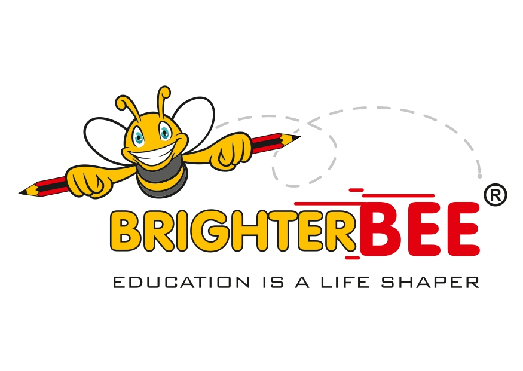

# BrighterBee LMS – Bee-Themed Learning Management System



## Project Overview

BrighterBee is a **bee-themed Learning Management System** designed specifically for **preschool education**. The platform caters to young learners in:

- **Nursery**
- **Junior KG**
- **Senior KG**

It features a **role-based LMS** with dedicated access for **Admin**, **Teacher**, and **Student** roles, focusing on **gamified, child-friendly learning** experiences.

---

## Features

### Authentication & Access Control
- Secure authentication with role-based access (Admin / Teacher / Student)
- Auto-confirm email signups for seamless onboarding
- Row Level Security (RLS) policies on all database tables

### Admin Dashboard
- User management and role assignment
- Platform-wide analytics
- Course oversight across all teachers
- Calendar management for system-wide events
- Transaction tracking and financial overview

### Teacher Dashboard
- Course and lesson management
- Quiz creation (text-only questions: MCQ and True/False)
- Student progress tracking and quiz results
- Calendar for class scheduling

### Student Dashboard
- Course browsing and enrollment
- Interactive quizzes with immediate feedback
- Gamified learning experience:
  - XP points and leveling system
  - Achievement badges
  - Daily streaks
  - Leaderboard rankings
- Progress tracking across enrolled courses
- Certificate preview pages (HTML only)

### UI/UX
- Bee-themed UI with consistent honey-colored design system
- Responsive design for all device sizes
- Child-friendly, engaging interface
- Smooth animations and transitions

---

## Tech Stack

| Layer | Technology |
|-------|------------|
| **Frontend** | React 18 + TypeScript |
| **Styling** | Tailwind CSS + shadcn/ui components |
| **Backend** | Supabase (Authentication + PostgreSQL) |
| **Database Security** | Row Level Security (RLS) policies |
| **Build Tool** | Vite |
| **State Management** | TanStack React Query |
| **Routing** | React Router v6 |
| **Form Validation** | Zod + React Hook Form |

---

## Project Structure

```
src/
├── assets/                    # Static assets (logos, images)
├── components/
│   ├── layout/               # Layout components (DashboardLayout)
│   └── ui/                   # Reusable UI components (shadcn/ui)
├── hooks/                    # Custom React hooks
│   ├── useAuth.tsx          # Authentication hook
│   └── useGamification.tsx  # Gamification logic
├── integrations/
│   └── supabase/            # Supabase client and types
├── lib/                     # Utility functions
├── pages/
│   ├── admin/               # Admin dashboard pages
│   │   ├── AdminDashboard.tsx
│   │   ├── AdminUsers.tsx
│   │   ├── AdminAnalytics.tsx
│   │   ├── AdminCourses.tsx
│   │   ├── AdminCalendar.tsx
│   │   └── AdminTransactions.tsx
│   ├── teacher/             # Teacher dashboard pages
│   │   ├── TeacherDashboard.tsx
│   │   ├── TeacherCourses.tsx
│   │   ├── CourseDetail.tsx
│   │   ├── CourseForm.tsx
│   │   ├── QuizManager.tsx
│   │   ├── QuizQuestions.tsx
│   │   ├── QuizResults.tsx
│   │   └── TeacherCalendar.tsx
│   ├── student/             # Student dashboard pages
│   │   ├── StudentDashboard.tsx
│   │   ├── StudentCourses.tsx
│   │   ├── StudentCourseDetail.tsx
│   │   ├── BrowseCourses.tsx
│   │   ├── TakeQuiz.tsx
│   │   ├── Leaderboard.tsx
│   │   ├── Badges.tsx
│   │   └── Certificate.tsx
│   ├── Auth.tsx             # Authentication page
│   ├── Index.tsx            # Landing page
│   └── NotFound.tsx         # 404 page
├── App.tsx                  # Main app with routing
├── main.tsx                 # Application entry point
└── index.css                # Global styles and design tokens
```

---

## Environment Variables

Create a `.env` file in the project root with the following variables:

```env
VITE_SUPABASE_URL=your_supabase_project_url
VITE_SUPABASE_ANON_KEY=your_supabase_anon_key
```

> **Note:** These are automatically configured when using Lovable Cloud.

---

## Local Setup Instructions

### Prerequisites
- Node.js 18+ installed
- npm or bun package manager

### Steps

1. **Clone the repository**
   ```bash
   git clone <YOUR_GIT_URL>
   cd <YOUR_PROJECT_NAME>
   ```

2. **Install dependencies**
   ```bash
   npm install
   ```

3. **Configure environment variables**
   - Create a `.env` file with your Supabase credentials (see above)

4. **Run the development server**
   ```bash
   npm run dev
   ```

5. **Open in browser**
   - Navigate to `http://localhost:5173`

---

## Deployment Notes

- **Frontend-only application** – all backend logic is handled by Supabase
- **Compatible with:**
  - Vercel
  - Render
  - Netlify
  - Any static hosting platform
- **Supabase** serves as the external backend (authentication, database, RLS)
- **No server-side backend required** – the app is fully client-side

### Deploy to Vercel

```bash
npm run build
# Deploy the `dist` folder to Vercel
```

---

## Security Notes

- **Role-based access** is enforced at the database level using RLS policies
- User roles are stored in a dedicated `user_roles` table (not in profiles)
- All sensitive operations are protected by RLS policies
- Quiz answers are verified server-side using secure RPC functions
- Console errors are suppressed in production builds
- **One-time admin bootstrapping** – first admin must be manually assigned

### RLS Policies Applied On:
- `profiles`
- `user_roles`
- `courses`
- `lessons`
- `lesson_progress`
- `enrollments`
- `quizzes`
- `quiz_questions`
- `quiz_attempts`
- `badges`
- `user_badges`
- `user_gamification`
- `user_streaks`
- `events`
- `transactions`

---

## Database Schema

### Core Tables
- `profiles` – User profile information
- `user_roles` – Role assignments (admin, teacher, student)
- `courses` – Course content by grade level
- `lessons` – Lessons within courses
- `enrollments` – Student course enrollments
- `quizzes` – Quizzes linked to courses
- `quiz_questions` – Questions for each quiz
- `quiz_attempts` – Student quiz submissions

### Gamification Tables
- `badges` – Available achievement badges
- `user_badges` – Earned badges per user
- `user_gamification` – XP and level tracking
- `user_streaks` – Daily activity streaks

### System Tables
- `events` – Calendar events
- `transactions` – Financial records

---

## License

This project is created for **personal/portfolio purposes**.

MIT License – Feel free to use and modify for your own projects.

---

## Author

Created with ❤️ using [Lovable](https://lovable.dev)

*Education is a Life Shaper* 🐝
